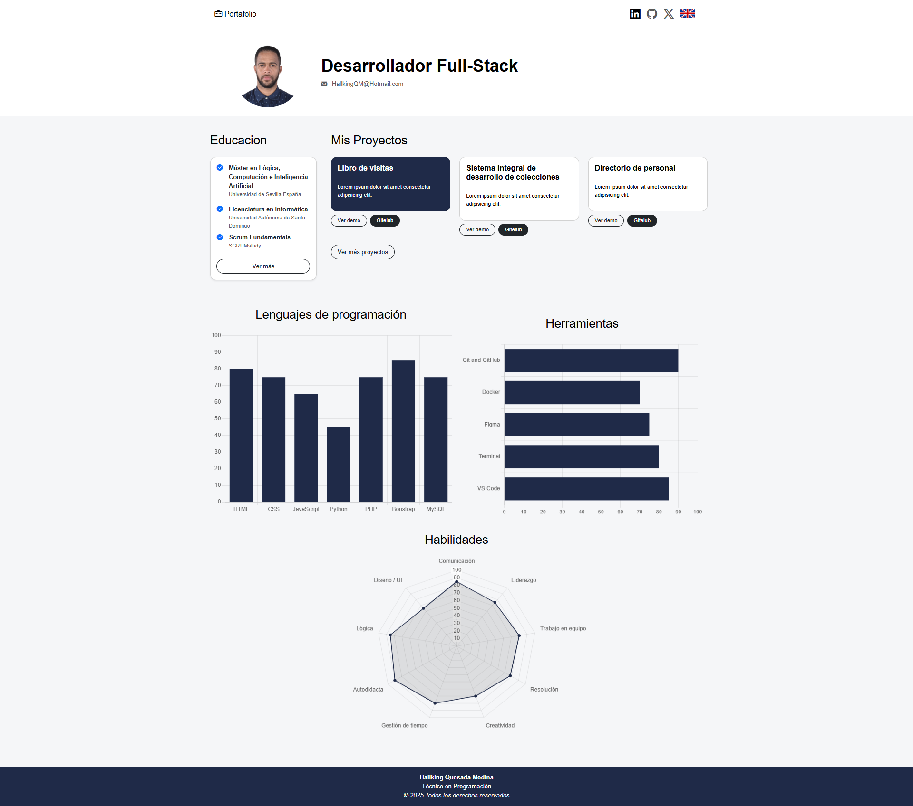

# 💼 Hallking Quesada Medina's Portfolio



Welcome to my personal portfolio. Here you will find a selection of my **web development projects**, my **academic background**, professional certifications, and technical skills.  
Designed to be **fast, responsive, and bilingual** (Spanish 🇩🇴 / English 🇬🇧).

---

## 🚀 Key Technologies
- **Frontend:** HTML5, CSS3, Bootstrap 5, Bootstrap Icons.
- **Backend:** PHP, MySQL.
- **Others:** JavaScript, Chart.js, Docker, Git/GitHub.
- **AI and Digital Content:** ChatGPT, Gemini.

## 📂 Project Structure

```
project/
│
├── css/
│ ├── bootstrap.min.css
│ └── style.css
│
├── img/
│ ├── HallkingFoto-min.png
│ ├── DO.png
│ ├── EN.png
│ └── preview.png
│
├── js/
│ ├── bootstrap.bundle.min.js
│ └── charts.js
│
├── index.html
├── educacion.html
├── proyectos.html
├── EN/
│ ├── education.html
│ └── projects.html
├── README.md
└── README_EN.md
```

---

## 📂 Featured Projects

### 📝 [Guestbook](#)
System for registering and managing visitors in an institution.  
**Technologies:** PHP, MySQL, Bootstrap, JavaScript, Ajax, Json.  

[🔗 Live Demo](#) | [💻 Code](#)

---

### 📚 [Collection Management System](#)
Web application for the comprehensive management of collections in the library field.  
**Technologies:** PHP, Bootstrap, MySQL, JavaScript.  

[🔗 Live Demo](#) | [💻 Code](#)

---

### 👥 [Staff Directory](#)
Interactive directory for searching and contacting staff within an organization.  
**Technologies:** PHP, MySQL, Bootstrap, JavaScript.  

[🔗 Live Demo](#) | [💻 Code](#)

---

## 📜 About Me
I am a **Full-Stack Developer** with experience in web projects, performance optimization, functional testing, and Artificial Intelligence tools applied to development.

📧 [HallkingQM@Hotmail.com](mailto:HallkingQM@Hotmail.com) <br>
🔗 [LinkedIn](https://www.linkedin.com/in/hallkingquesadamedina/) | [GitHub](https://github.com/HallkingQM) | [X (Twitter)](https://x.com/HallkingM66318)

---

## 🌐 Languages
- **Spanish (es_DO)** → Main version.  
- **English (en_US)** → Alternative version.  

Easily switch languages using the flag icons in the navigation bar.

---

## 📄 License
This project is licensed under the **MIT License** – you may use, modify, and share it with attribution.